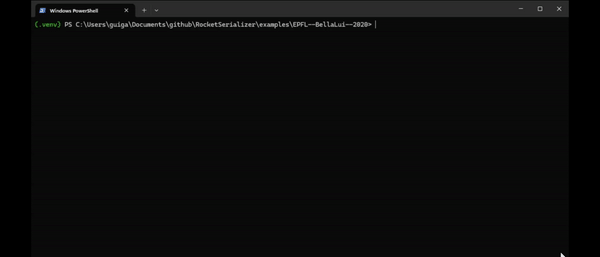

<br>

[](https://docs.rocketpy.org/en/latest/?badge=latest)
[](https://discord.gg/b6xYnNh)
[](https://github.com/sponsors/RocketPy-Team)
[](https://www.instagram.com/rocketpyteam)
[](https://www.linkedin.com/company/rocketpy)

<br>

# Rocket Serializer

`rocketserializer` is a Python library that provides serialization capabilities
for OpenRocket files. It allows you to read OpenRocket files (.ork) using a
simple and intuitive command line interface. After serializing the file, you
can use the data to create your RocketPy simulation.

## Example



## Installation

You can install `rocketserializer` using pip:

```shell
pip install rocketserializer
```

## Requirements

### Java

You need Java to be installed on your system to use `rocketserializer`.
We recommend downloading Java 17, which is required to run OpenRocket-23.09.

https://www.oracle.com/java/technologies/downloads/

### OpenRocket

You also need to download the OpenRocket JAR file. You can download it from the
following link:

https://openrocket.info/downloads.html?vers=23.09#content-JAR

Each version of OpenRocket has its own jar file, and it is important to use the
correct java version to run the jar file.

### Python Packages

Once you download the `rocketserializer` package, the following dependencies
will be automatically installed:

- bs4
- click>=8.0.0
- lxml
- numpy
- orhelper==0.1.3
- pyyaml
- rocketpy>=1.1.0
- nbformat>=5.2.0

## Usage - command line interface

The `rocketserializer` package will automatically install 2 command-line-interface (cli)
options, here's an example:

### Serialization

To create a `parameters.json` file from an OpenRocket file, use the following command:

```bash
ork2json --filepath your_rocket.ork
```

Or, for a more verbose output, you can use the following command:

```bash
ork2json --filepath your_rocket.ork --verbose True
```

The options are the following:

- `--filepath`: The .ork file to be serialized.
- `--output` : Path to the output folder. If not set, the output will be saved in the same folder as the `filepath`.
- `--ork_jar` : Specify the path to the OpenRocket jar file. If not set, the library will try to find the jar file in the current directory.
- `--encoding` : The encoding of the .ork file. By default, it is set to `utf-8`.
- `--verbose` : If you want to see the progress of the serialization, set this option to True. By default, it is set to False.

Only  the `--filepath` option is mandatory.

### Creating a simulation notebook

```bash
ork2notebook --filepath your_rocket.ork
```

The options are pretty much the same as the serialization command!

### Limitations

This code won't work for your rocket if it has any of the following features:

- Your .ork file must be saved in English
- Your .ork file must be saved with at least 1 simulation data
- Only one single stage is supported
- Only a single motor is supported
- Only a single nose cone is supported

## Roadmap

- 2024 June : First public release, start receiving feedback from the community.

Before the first public release, we will listen to the community's feedback before defining the roadmap for the next releases.

## Contact

If you find any bug or if you want to request new features, please open an issue
on GitHub.
In case you don't have a GitHub account, you can reach out to us on RocketPy's
Discord server.

## How to Contribute

The 3 main ways of contributing to this project are:

1. **Reporting bugs and suggesting new features.**
    - Use GitHub, preferably, to report bugs and suggest new features.
    - In case you don't have a GitHub account, you can reach out to us on RocketPy's Discord server
2. **Sharing .ork files that can be used to test the library.**
    - If you have a .ork file that is not working with the library, please share it with us.
    - If you have a .ork file that is working with the library, please share it with us.
    - If you allow us to use and share your .ork file, we can add it to the test suite.
3. **Developing new features and fixing bugs thorough pull requests on GitHub.**
    - If you want to develop new features, you are more than welcome to do so.
    - Please reach out to the maintainers to discuss the new feature before starting the development. 
